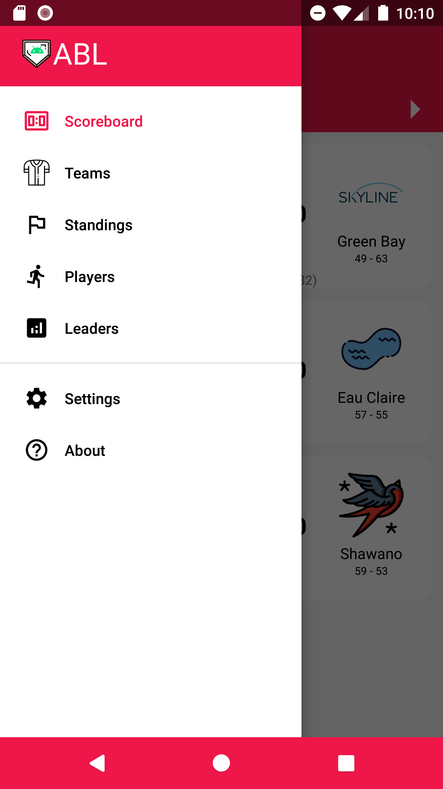
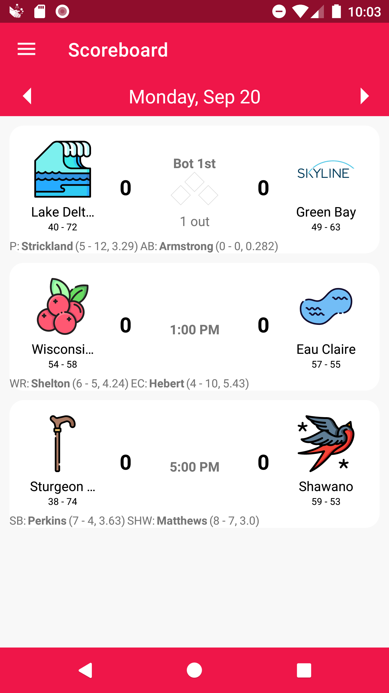
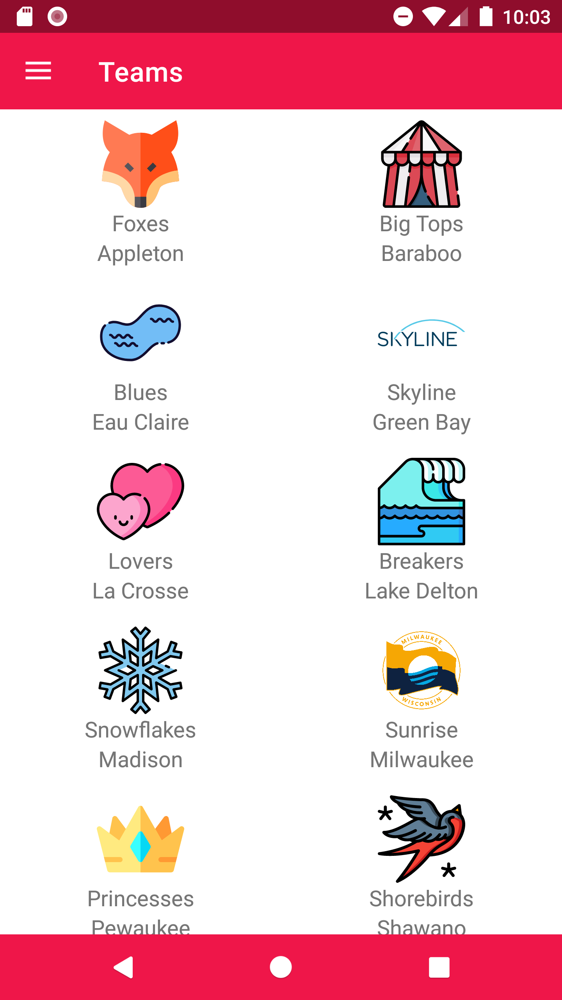
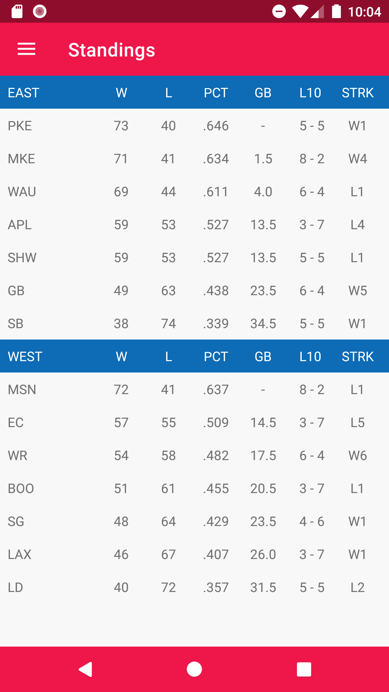
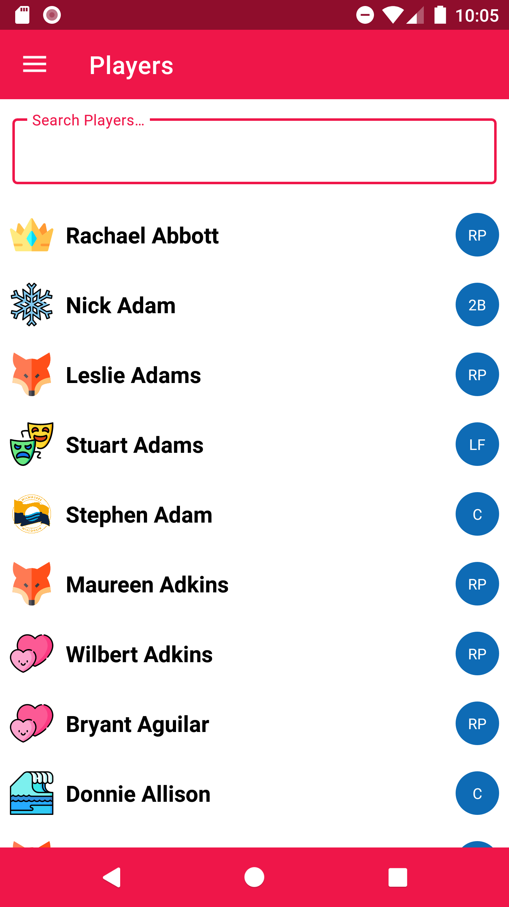
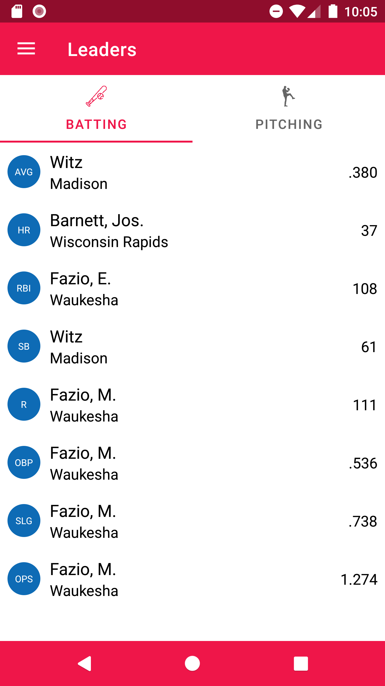
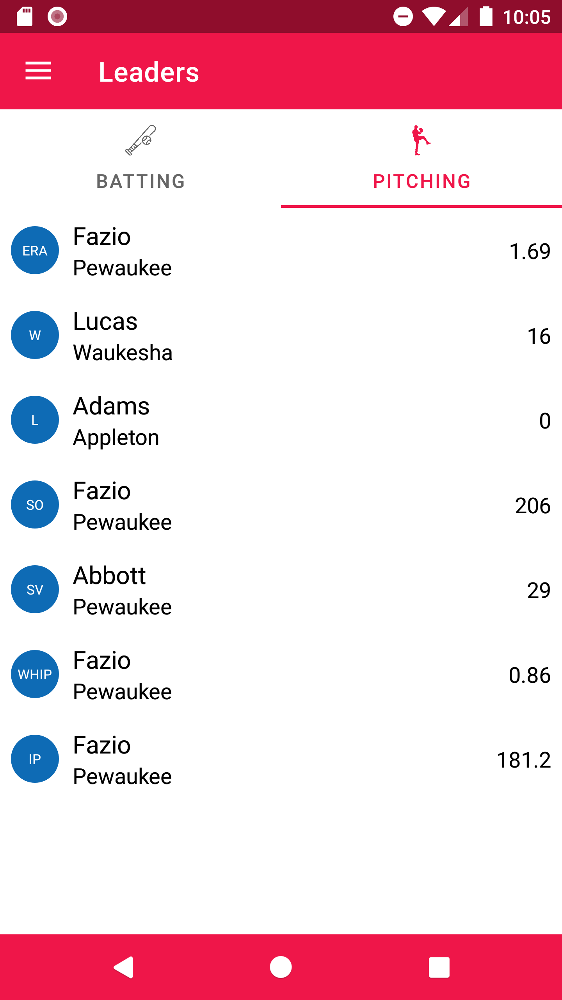
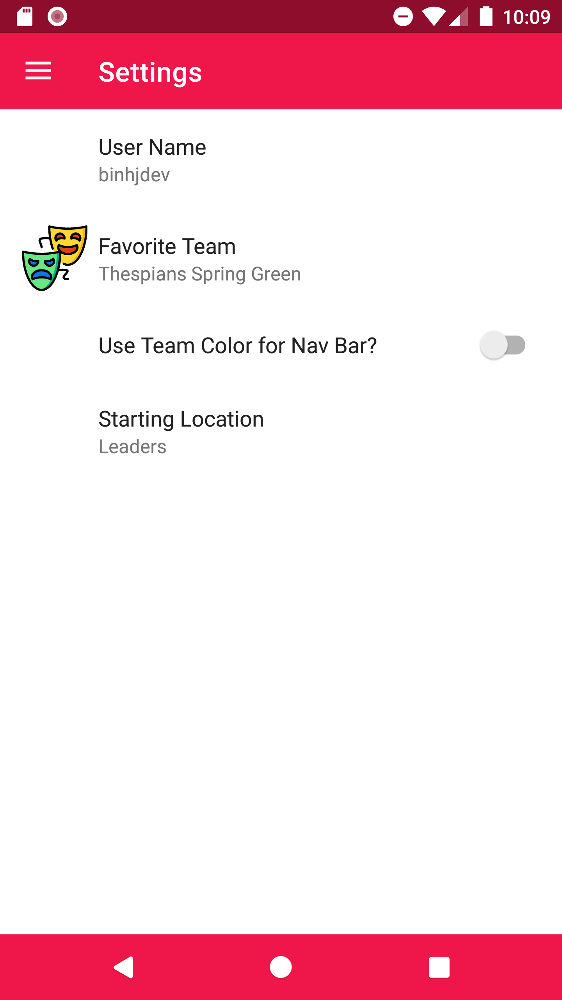
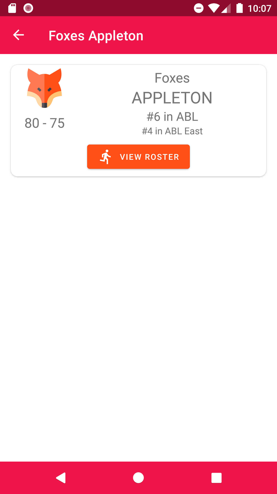
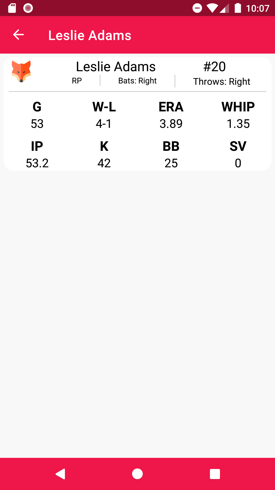

# BaseballLeague App
[Function reactive programming (FRP) Simple Android Baseball League application written in Kotlin, using Android Architecture Components(Room, LiveData, ViewModel, Paging, Lifecycle, WorkManager, Preference), Retrofit2, Moshi, MVVM Pattern

## Screenshots
|  |  |   |
| :---:                              | :---:                             | :---:                              |
|   |  |   |
|   |  |   |
|   |  |   |
| 

## Features

- Architecture MVVM Android Architecture Components (Room, LiveData, ViewModel, Paging, Lifecyle, Preference)
- Full reactive programming with [RxKotlin](https://github.com/ReactiveX/RxKotlin).
- Networking with [Retrofit](https://square.github.io/retrofit/), [Moshi](https://github.com/square/moshi)
- Search data with [Paging](https://developer.android.com/topic/libraries/architecture/paging/v3-overview)
- Local data with [Room Persistence](https://developer.android.com/topic/libraries/architecture/room).
- Update user with [Jetpack WorkManager](https://developer.android.com/topic/libraries/architecture/workmanager).

## Trying:

  [Debug apk](https://github.com/binhjdev/BaseballLeague/raw/master/outputs/app-debug.apk)
